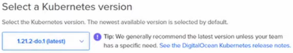
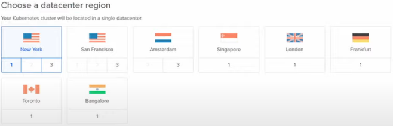
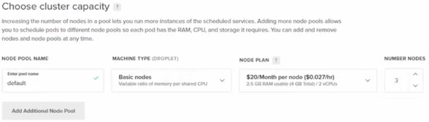
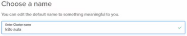

# Como gerar valor em uma entrega com pipeline CI/CD

### Pipeline

> **pipeline** é também chamado de **esteira**

* **Definição**: sequência de etapas de execução

### CI

* **Definição**

  * **CI** = (C)ontinuos (I)ntegration (**Integração contínua**)

  * Consiste na integração de um "código novo" em uma aplicação existente por meios de sequência de etapas

  * Essas etapas são:

    * Teste unitário
    * Teste funcional
    * Teste de integração de
    * Validação de código e qualidade
    * Segurança de código

### CD

* **Definição**

  * **CD** = (C)ontinuos (D)elivery (**Entrega contínua**)

  * Consiste na entrega contínua do "produto" (código) em um ambiente, após a realização das pipelines CI

  * É possível ter uma pipeline CD para cada ambiente (entrega, homologação, produção)

  * **Objetivo**: pegar um artefato, gerado na pipeline CI, e fazer o deploy desse artefato em um ambiente

### Github Action

* **Workflow**

  * **Definição**: rotina de execução no repositório

  * **Componentes**

    * _jobs_: sequência de passos executados no workflow de forma sequêncial e paralelo

    * _events_: estímulos/ações que são responsáveis pelo disparo do workflow

      > Alguns _events_: pull request, push em uma branch, web hook de outro workflow

    * _steps_: execuções de comandos dentro do _job_, em shell, powershell ou actions

      > OBS: por estarem no mesmo _job_, os _steps_ compartilham dados entre si (**Exemplo**: arquivos)

    * _actions_: instruções executadas através de blocos de configurações

      > OBS: é possível utilizar _actions_ já existentes na comunidade

    * _runners_: agentes (serviços disponibilizados pelo Github ou próprios) de execução dos jobs


* **Exemplo de um workflow**

  ```yml
  name: CI-CD # nome do workflow

  on: # eventos
    push: # disparo do evento quando dar um push em determinada(s) branche(s)
      branches: [ master ]
    pull_request: # disparo do evento quando fazer um pull request em determinada(s) branche(s)
      branches: [ master ]

    workflow_dispatch: # execução manual do workflow

  jobs:
    CI:
      runs-on: ubuntu-latest

      steps:
        - uses: actions/checkout@v2

        - name: Docker Login # configuração para autenticação no Docker Hub
          uses: docker/login-action@v1.10.0
          with:
            username: ${{ secrets.DOCKERHUB_USER }} # uso de secrets (armazenar dados sensíveis a partir de "chave-valor")
            password: ${{ secrets.DOCKERHUB_PWD }}

        - name: Build and push Docker images
          uses: docker/build-push-action@v2.6.1
          with: # parâmetros que serão utilizados para a criação da imagem a partir do Dockerfile
            context: ./src # Contexto
            file: ./src/Dockerfile # caminho até o Dockerfile
            push: true # fazer o push da imagem no Docker Hub
            tags: | # tags da imagem utilizada ("|" = continuar na próxima linha)
              imgabreuw/rotten-potatoes:latest
              imgabreuw/rotten-potatoes:${{ github.run_number }}

    CD:
      runs-on: ubuntu-latest 
      needs: [CI] # Cd só será executado após a CI ser concluído
      
      steps:
        - uses: actions/checkout@v2
        
        - name: Kubernetes set context
          uses: Azure/k8s-set-context@v1.1
          with:
            method: kubeconfig # método de autenticação para definir o contexto no cluster
            kubeconfig: ${{ secrets.K8S_CONFIG }}
  ```

  * **Para adicionar um secret**: 

### Digital Ocean

* **Criação do _cluster_ Kubernetes**

  * No painel da DigitalOcean > Manage > Kubernetes > Create > Kubernetes 

    

    

    

    

    **Botão: Create Cluster**

  > **IMPORTANTE**: desligar e remover o _cluster_ após sua utilização

  * Clicar no botão: `Download Config File`