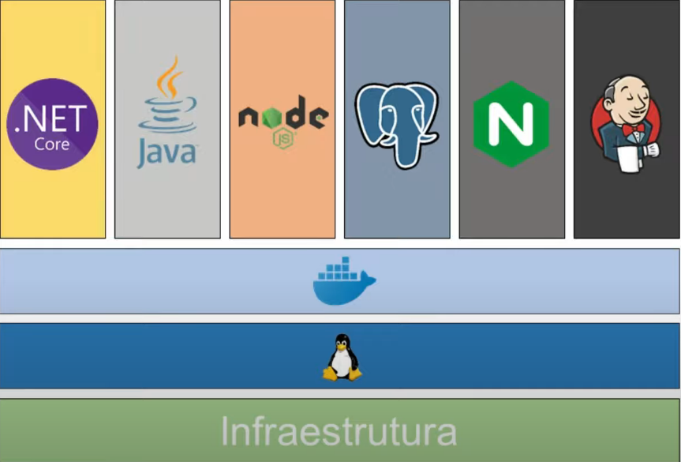
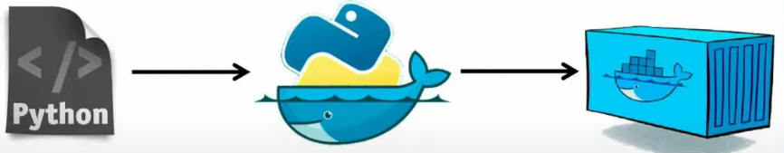
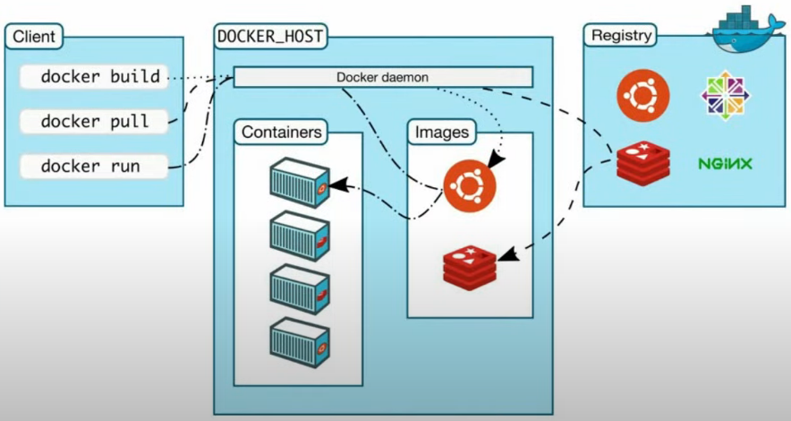
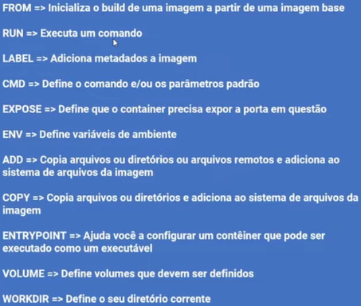

# AULA 1 - CONTAINER E DOCKER SIMPLIFICADOS

### Importância de Container e Kubernetes

* Crescimento da adoção da arquitetura de microsserviços (Container e cultura DevOPS)

* Facilitar a transição entre os ambientes de desenvolvimento > homologação > produção 

* Maior produtividade para as equipes de desenvolvimento e infraestrutura

* **Kubernetes** é agnósticos, ou seja, roda em vários lugares, e não de depende de linguagem de programação

### Container

* **Definição**

  * Isolar processos em um ambiente para prevenir possíveis erros (conflitos de configuração ou de ferramental)

* **Vantagens**

  * Padrão de execução

  * Acaba o problema de "Mas na minha máquina funciona"

* **Conceitos importantes**

  * **Containerização e Virtualização**

    * Na virtualização

      

      * **Problemas**

        * Para cada máquina há a necessidade de instalar e gerenciar o sistema operacional

        * Alto custo (quantidade de recursos que o sistema operacional consome)

    * Na containerização

      

      * **Vantagens**

        * Simplificação de gestão (1 único sistema operacional e os _container runtime_ o simula)

        * Economia de recurso

### Docker

* **Definição**

  * Gerenciador de containers

  > OBS: Docker não criou o container, mas criou um ferramental para facilitar a sua manipulação

* **Utilização**

  * Imagens Docker + Containers

* **Conceitos importantes**

  * **Imagem Docker** 
    
    * _templates_ (**molde**) utilizados para a criação e execução de um container

      

  * **Container**

    * É a instanciação de uma artefato em execução

      

  * **Arquitetura do Docker**

    

    * Docker daemon (**dockerd**)
      
      * Componente de gerência os objetos do Docker (imagens/containers/networks/volumes)

      * Responsável pela execução dos containers

    * Docker client

      * Docker CLI faz a comunicação com o **dockerd** 

      > CLI = (C)ommand (L)ine (I)nterface

    * Docker registry

      * Repositório de imagens Docker (armazenar e distribuir imagens)

      > Analogamente a um repositório Git

    > OBS: Docker daemon e Docker client não precisam estar na mesma máquina

### Comandos Docker

* Criar um container: 

  * `$ docker container run <imagem>`

  * `$ docker run <imagem>`

* Listagem de container em execução: 
  
  * `$ docker container ls`

  * `$ docker ps`

* Listagem de todos os containers: `$ docker container ls -a`

* Listagem das imagens: `$ docker image ls`

* Renomear um container: `$ docker container run --name <nome> <container>`

* Criar um container interativo (com mouse)

  * `$ docker container run -it <imagem> /bin/bash`

    * `-i` = modo interativo
    * `-t` = Docker TTY (acesso console)

  * `$ docker container exec -it <id> /bin/bash`

  * `$ docker container run -it <namespace>/<repositório>:<tag> /bin/bash`

    > Por padrão, o Docker pega a tag **latest**, por isso a importância de criar essa tag ao dar push no _Docker Hub_

  * **Exemplo**: 
    
    * `$ docker container run -it ubuntu /bin/bash`

    * `$ docker container run -it imgabreuw/ubuntu-curl:v1 /bin/bash`

* Remover um container: 
  
  * `$ docker container rm <id do container>`

  * `$ docker container rm <nome do container>`

* Executar um container em **modo daemon** (segundo-plano)

  * `$ docker container run -d <imagem>`

  * **Exemplo**: `docker container run -d nginx`

* **Binding** (ligação) entre máquina local e o container

  * `$ docker container run -d -p <porta local>:<porta container> <imagem>`

* Parar a execução de um container: `$ docker container stop <id>`

* Forçar a exclusão de um container: `$ docker container stop <nome>`

* Histórico de construção de uma imagem:`$ docker image history <imagem>`

* Remover imagens utilizadas na construção: `$ docker image prune`

### Dockerfile

* Arquivo que contem todas as instruções necessárias para criar um _container_

* Como construir uma imagem docker

  * Definir a imagem base: 
  
    * **Sintaxe**: `FROM <imagem>`

    * **Exemplo**: `FROM ubuntu`

  * Rodar um comando

    * **Sintaxe**: `RUN <comando>`

    * **Exemplo**: `RUN apt update`

  * **Exemplo**

    ```dockerfile
    FROM ubuntu

    RUN apt-get update
    RUN apt-get install curl -y
    ```

    **Boa prática utilizar o `&&`, pois evita o reaproveitamento de um cache antigo**
    ```dockerfile
    FROM ubuntu

    RUN apt-get update && apt-get install curl -y
    ```

* Criar uma imagem a partir do **Dockerfile**: 
  
  * **Sintaxe**: `$ docker image build -t <namespace>/<repositório>:<tag> <contexto>`

    > **contexto** = caminho até o Dockerfile

  * **Exemplo**: `$ docker image build -t imgabreuw/ubuntu-curl:v1 .`

  * **OBS**: Docker possui uma inteligência para reaproveitar a imagem criada anteriormente e executar apenas as instruções novas. (camadas/passos cacheados)

* Opções de uso no **Dockerfile**

  


### Docker registry

* **Vantagem**: Facilitar a distribuição da imagem de um container para servidores e/ou desenvolvedores

* Serviço padrão do Docker registry: [Docker Hub](https://hub.docker.com/)

* Autenticação no _Docker Hub_: `$ docker login`

* **Padrão para enviar uma imagem ao _Docker Hub_**

  * **Estrutura**: `<namespace>/<repositório>:<tag>`

    * `namespace` = proprietário da imagem (conta no _Docker Hub_)

    * `repositório` = nome da aplicação/microsserviço (**geralmente**)

    * `tag` = versão da imagem

      * É uma boa prática informar a `tag`, pois assim o torna a imagem **idempotente** (**garantia de um mesmo comportamento**)

      * Importante criar uma `tag latest` = última versão da imagem

  * **Passo a passo**

    * 1º - Fazer o build do Dockerfile

    * 2º - Enviar imagem para o _Docker Hub_: `$ docker push <namespace>/<repositório>:<tag>`

    * 3º - Criar uma **tag latest** da imagem (**boa prática**): `$ docker tag <namespace>/<repositório>:<tag> <namespace>/<repositório>:latest`

### Projeto **api-conversao**

* Criação do **Dockerfile**

  ```dockerfile
  FROM node:14.16.1-alpine3.13

  WORKDIR /app

  COPY package*.json ./ 

  RUN npm install

  COPY . .

  EXPOSE 8080

  CMD ["node", "index.js"]
  ```

* Criação do **.dockerignore**

  ```
  node_modules/
  ``` 

* Criar a imagem v1: `$ docker image build -t imgabreuw/api-conversao:v1 .` 

* Push da imagem (v1) para o Docker Hub: `$ docker push imgabreuw/api-conversao:v1`

* Criar a imagem latest: `$ docker tag imgabreuw/api-conversao:v1 imgabreuw/api-conversao:latest` 

* Push da imagem (v1) para o Docker Hub: `$ docker push imgabreuw/api-conversao:latest`

* Rodar a aplicação localmente: `$ docker container run -d -p 8080:8080 imgabreuw/api-conversao:v1`

* Verificar se está funcionando corretamente: `$ docker container ls`

* Entrar em: [API](http://localhost:8080/api-docs/)